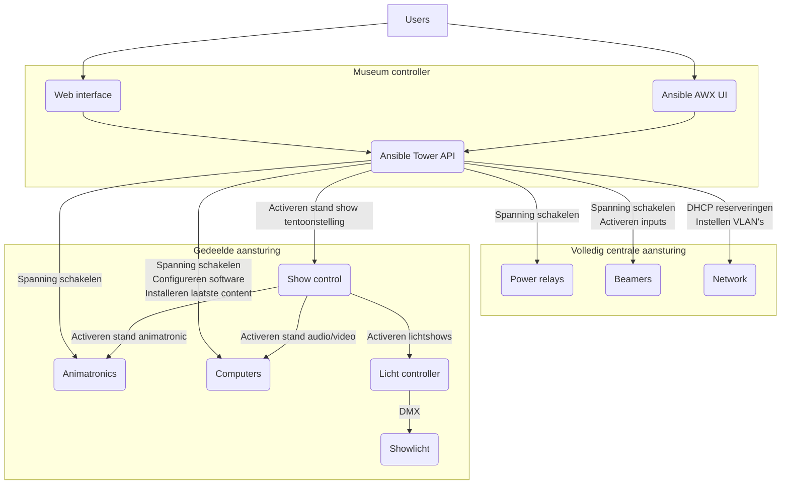

# Design show control museum

```mermaid
graph TD
    A[Users] --> B(Web interface)
    A[Users] --> C(Ansible AWX UI)
    subgraph Museum controller
    B --> D(Ansible Tower API)
    C --> D
    end
    D -->|Activeren stand show tentoonstelling| E(Show control)
    D -->|Spanning schakelen| G(Animatronics)
    D -->|Spanning schakelen<br/>Configureren software<br/>Installeren laatste content| F(Computers)
    subgraph Volledig centrale aansturing
    D -->|Spanning schakelen| H(Power relays)
    D -->|Spanning schakelen<br/>Activeren inputs| I(Beamers)
    D -->|DHCP reserveringen<br/>Instellen VLAN's| J(Network)
    end
    subgraph Gedeelde aansturing
    E -->|Activeren lichtshows| K(Licht controller)
    E -->|Activeren stand audio/video| F
    E -->|Activeren stand animatronic| G
    K -->|DMX| L(Showlicht)
    end
```
